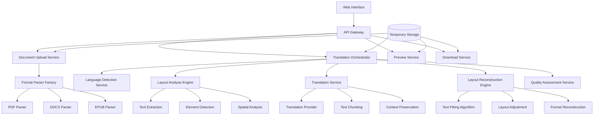

# Design Document

## Overview

The multimodal document translation system is designed as a comprehensive web application that preserves document layout and formatting while translating content across multiple formats (PDF, DOCX, EPUB). The system extends the existing basic OCR-based translator to include advanced layout analysis, intelligent text replacement, and format-specific processing capabilities.

The architecture follows a modular approach with separate components for document parsing, layout analysis, translation, layout reconstruction, and quality assessment. The system maintains the existing FastAPI/Gradio foundation while adding sophisticated document processing pipelines.

## Architecture

### High-Level Architecture



### Core Components

1. **Document Processing Pipeline**: Handles format-specific parsing and reconstruction
2. **Layout Analysis Engine**: Analyzes spatial relationships and visual elements
3. **Translation Service**: Manages translation with context preservation
4. **Layout Reconstruction Engine**: Rebuilds documents with translated content
5. **Quality Assessment Service**: Evaluates translation quality and layout preservation

## Components and Interfaces

### 1. Document Parser Factory

**Purpose**: Provides format-specific parsers for different document types

```python
class DocumentParserFactory:
    def create_parser(self, file_format: str) -> DocumentParser
    
class DocumentParser(ABC):
    def parse(self, file_path: str) -> DocumentStructure
    def reconstruct(self, structure: DocumentStructure) -> bytes
```

**Key Implementations**:
- `PDFParser`: Uses PyMuPDF for advanced PDF manipulation
- `DOCXParser`: Uses python-docx with layout preservation
- `EPUBParser`: Uses ebooklib for EPUB processing

### 2. Layout Analysis Engine

**Purpose**: Analyzes document structure and spatial relationships

```python
class LayoutAnalysisEngine:
    def analyze_layout(self, document: DocumentStructure) -> LayoutAnalysis
    def extract_text_regions(self, page: PageStructure) -> List[TextRegion]
    def detect_visual_elements(self, page: PageStructure) -> List[VisualElement]
    def calculate_spatial_relationships(self, elements: List[Element]) -> SpatialMap
```

**Key Features**:
- Text region identification with bounding boxes
- Visual element detection (images, charts, tables)
- Spatial relationship mapping
- Reading order determination

### 3. Translation Service

**Purpose**: Handles translation with context and layout awareness

```python
class TranslationService:
    def detect_language(self, text: str) -> LanguageDetection
    def translate_with_context(self, regions: List[TextRegion], 
                             source_lang: str, target_lang: str) -> List[TranslatedRegion]
    def preserve_formatting(self, original: TextRegion, 
                          translated: str) -> FormattedText
```

**Key Features**:
- Context-aware translation using surrounding text
- Formatting preservation (bold, italic, fonts)
- Batch processing for efficiency
- Translation confidence scoring

### 4. Layout Reconstruction Engine

**Purpose**: Rebuilds documents with translated content and adjusted layouts

```python
class LayoutReconstructionEngine:
    def fit_translated_text(self, region: TextRegion, 
                          translated: str) -> AdjustedRegion
    def adjust_layout(self, page: PageStructure, 
                     adjustments: List[AdjustedRegion]) -> PageStructure
    def resolve_conflicts(self, conflicts: List[LayoutConflict]) -> List[Resolution]
```

**Key Features**:
- Intelligent text fitting algorithms
- Dynamic layout adjustment
- Conflict resolution for overlapping elements
- Font size and spacing optimization

### 5. Quality Assessment Service

**Purpose**: Evaluates translation quality and layout preservation

```python
class QualityAssessmentService:
    def assess_translation_quality(self, original: str, 
                                 translated: str) -> QualityScore
    def assess_layout_preservation(self, original: LayoutAnalysis, 
                                 reconstructed: LayoutAnalysis) -> LayoutScore
    def generate_quality_report(self, assessments: List[Assessment]) -> QualityReport
```

## Data Models

### Core Data Structures

```python
@dataclass
class DocumentStructure:
    format: str
    pages: List[PageStructure]
    metadata: DocumentMetadata
    
@dataclass
class PageStructure:
    page_number: int
    dimensions: Dimensions
    text_regions: List[TextRegion]
    visual_elements: List[VisualElement]
    spatial_map: SpatialMap
    
@dataclass
class TextRegion:
    id: str
    bounding_box: BoundingBox
    text_content: str
    formatting: TextFormatting
    language: str
    confidence: float
    
@dataclass
class VisualElement:
    id: str
    element_type: str  # image, chart, table, etc.
    bounding_box: BoundingBox
    content: bytes
    metadata: Dict[str, Any]
    
@dataclass
class TranslatedRegion:
    original_region: TextRegion
    translated_text: str
    translation_confidence: float
    layout_adjustments: List[LayoutAdjustment]
    
@dataclass
class QualityScore:
    overall_score: float
    translation_accuracy: float
    layout_preservation: float
    readability: float
    issues: List[QualityIssue]
```

### Configuration Models

```python
@dataclass
class TranslationConfig:
    source_language: str
    target_language: str
    preserve_formatting: bool = True
    quality_threshold: float = 0.8
    max_layout_adjustment: float = 0.1
    
@dataclass
class ProcessingConfig:
    supported_formats: List[str]
    max_file_size: int
    temp_storage_duration: int
    concurrent_processing: bool = True
```

## Error Handling

### Error Categories

1. **File Processing Errors**
   - Invalid file format
   - Corrupted files
   - File size limitations
   - Parsing failures

2. **Translation Errors**
   - Unsupported language pairs
   - Translation service failures
   - Context preservation issues
   - Quality threshold violations

3. **Layout Processing Errors**
   - Layout analysis failures
   - Text fitting conflicts
   - Reconstruction errors
   - Format compatibility issues

### Error Handling Strategy

```python
class DocumentTranslationError(Exception):
    def __init__(self, message: str, error_code: str, 
                 recoverable: bool = False):
        self.message = message
        self.error_code = error_code
        self.recoverable = recoverable

class ErrorHandler:
    def handle_processing_error(self, error: Exception) -> ErrorResponse
    def suggest_recovery_actions(self, error: DocumentTranslationError) -> List[str]
    def log_error_metrics(self, error: Exception) -> None
```

## Testing Strategy

### Unit Testing

- **Document Parsers**: Test format-specific parsing and reconstruction
- **Layout Analysis**: Test element detection and spatial analysis
- **Translation Service**: Test translation accuracy and context preservation
- **Layout Reconstruction**: Test text fitting and layout adjustment algorithms
- **Quality Assessment**: Test scoring algorithms and report generation

### Integration Testing

- **End-to-End Workflows**: Test complete document processing pipelines
- **Format Compatibility**: Test cross-format consistency
- **Language Pair Testing**: Test various language combinations
- **Performance Testing**: Test processing speed and memory usage

### Quality Assurance Testing

- **Layout Preservation**: Visual comparison of original vs translated documents
- **Translation Accuracy**: Human evaluation of translation quality
- **User Experience**: Usability testing of preview and download features
- **Edge Case Handling**: Test with complex documents and unusual layouts

### Test Data Strategy

```python
class TestDataManager:
    def generate_test_documents(self) -> List[TestDocument]
    def create_language_test_matrix(self) -> List[LanguagePair]
    def prepare_layout_test_cases(self) -> List[LayoutTestCase]
    def validate_test_results(self, results: TestResults) -> ValidationReport
```

### Performance Benchmarks

- **Processing Speed**: Target < 30 seconds for typical documents
- **Memory Usage**: Target < 2GB peak memory per document
- **Translation Quality**: Target > 0.85 average quality score
- **Layout Preservation**: Target > 0.90 layout similarity score

### Continuous Testing

- Automated regression testing on document format updates
- Performance monitoring with alerting
- Quality metrics tracking over time
- User feedback integration for continuous improvement